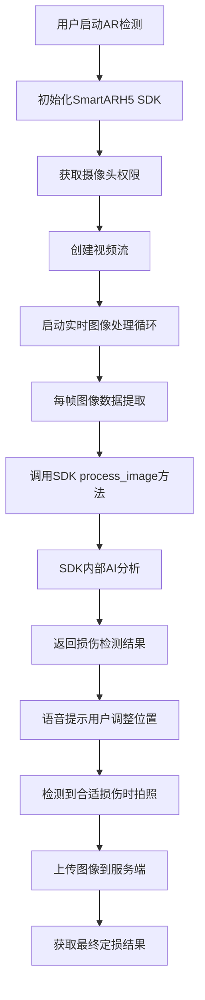

# AR定损SDK工作流程分析

## 📋 **基于代码分析的SDK工作原理**

通过分析你的项目代码，我已经基本理解了AR定损SDK的工作逻辑。这个SDK采用了**黑盒封装**，但通过接口调用模式可以推断出其内部机制。

---

## 🔍 **核心工作流程解析**

### **1. 整体架构流程**



### **2. 关键技术组件**

#### **2.1 SmartARH5 SDK核心接口**
```javascript
// SDK主要接口调用
SmartARH5.init(null)                    // 初始化SDK
SmartARH5.start_ar(arMode)              // 启动AR模式
SmartARH5.process_image(                // 处理图像帧
  imageData.data,                       // 图像像素数据
  imageData.width,                      // 图像宽度  
  imageData.height,                     // 图像高度
  null, null,                           // 预留参数
  resultCallback,                       // 处理结果回调
  endCallback                           // 处理完成回调
)
SmartARH5.stop_ar()                     // 停止AR
```

#### **2.2 实时图像处理循环**
```javascript
// 30fps的图像处理循环
setInterval(() => {
  // 1. 从视频流获取当前帧
  ctx.drawImage(video, 0, 0, canvas.width, canvas.height);
  
  // 2. 提取图像数据
  const imageData = ctx.getImageData(0, 0, canvas.width, canvas.height);
  
  // 3. 调用SDK处理
  SmartARH5.process_image(imageData.data, width, height, ...);
  
}, 1000 / 30);
```

---

## 🎯 **客户提示与引导逻辑**

### **3. 位置引导系统**

#### **3.1 步骤代码含义推断**
基于语音提示映射表，SDK返回的步骤代码含义：

| 步骤代码 | 中文提示 | 英文提示 | 推断含义 |
|----------|----------|----------|----------|
| `0` | 请对准损伤处 | Please aim at the damaged area | **初始状态，未找到损伤** |
| `1` | 请靠近损伤 | Please move closer to the damage | **检测到损伤，距离太远** |
| `2` | 请远离一点 | Please move away a bit | **距离太近，需要后退** |
| `3` | 请远离一点 | Please move away a bit | **距离过近，继续后退** |
| `12` | 请继续靠近 | Please continue to move closer | **方向正确，继续靠近** |
| `21` | 请靠近损伤 | Please move closer to the damage | **从太近转为太远** |
| `23` | 请远离一点 | Please move away a bit | **从太近转为更近** |
| `13` | 请保持静止 | Please keep still | **位置合适，准备拍照** |
| `123` | 请保持静止 | Please keep still | **达到最佳拍摄位置** |

#### **3.2 位置判断算法推断**
```javascript
// SDK内部可能的位置判断逻辑
function analyzePosition(detectedDamage) {
  const distance = calculateDistance(detectedDamage);
  const angle = calculateAngle(detectedDamage);
  const clarity = calculateClarity(detectedDamage);
  
  if (!detectedDamage.found) {
    return { step: "0", action: "aim_at_damage" };
  }
  
  if (distance > OPTIMAL_DISTANCE_MAX) {
    return { step: "1", action: "move_closer" };
  }
  
  if (distance < OPTIMAL_DISTANCE_MIN) {
    return { step: "2", action: "move_away" };
  }
  
  if (angle > OPTIMAL_ANGLE_THRESHOLD) {
    return { step: "0", action: "aim_better" };
  }
  
  if (clarity > CAPTURE_THRESHOLD) {
    return { step: "13", action: "capture_ready" };
  }
  
  return { step: "1", action: "adjust_position" };
}
```

### **4. 损伤检测与分类**

#### **4.1 检测范围推断**
基于代码中的损伤类型，SDK可能检测：

```javascript
// 检测的损伤类型（推断）
const DAMAGE_TYPES = {
  "scratchDamage": "划痕损伤",
  "dentDamage": "凹陷损伤", 
  "crackDamage": "裂纹损伤",
  "missingPartDamage": "缺失部件",
  "brokenDamage": "破损",
  "other": "其他损伤"
};

// 车辆方向检测
const DIRECTIONS = {
  "FRONT": "前方",
  "REAR": "后方", 
  "LEFT": "左侧",
  "RIGHT": "右侧",
  "FRONT_LEFT": "左前",
  "FRONT_RIGHT": "右前",
  "REAR_LEFT": "左后",
  "REAR_RIGHT": "右后"
};
```

#### **4.2 拍照触发条件**
```javascript
// 推断的拍照触发逻辑
function shouldCapture(result) {
  return (
    result.ext?.info?.step === "13" ||     // 位置最佳
    result.ext?.info?.step === "123" ||    // 连续最佳位置
    result.ext?.clarity > CAPTURE_THRESHOLD &&  // 清晰度达标
    result.ext?.confidence > MIN_CONFIDENCE      // 置信度达标
  );
}
```

---

## 🎵 **多媒体引导系统**

### **5. 语音提示机制**

#### **5.1 双重语音系统**
```javascript
// 1. 预录音频文件（优先使用）
const AUDIO_FILES = {
  "Please aim at the damaged area": "PleaseAimAtTheDamagedArea.mp3",
  "Please move closer to the damage": "PleaseMoveCloserToTheDamage.mp3",
  "Please move away a bit": "PleaseMoveAwayABit.mp3",
  // ... 更多音频文件
};

// 2. TTS文本转语音（备用方案）
const speech = new SpeechSynthesisUtterance(text);
speech.lang = language === "zh" ? "zh-CN" : "en-US";
window.speechSynthesis.speak(speech);
```

#### **5.2 智能音频选择**
```javascript
// 音频播放优先级
async function playAudio(text) {
  try {
    // 优先尝试预录音频（音质更好）
    await this.tryPlayPrerecorded(text);
  } catch (error) {
    // 降级到TTS（兼容性更好）
    this.playTTS(text);
  }
}
```

---

## 📸 **图像处理与上传流程**

### **6. 图像捕获时机**

#### **6.1 自动拍照触发**
```javascript
// 检测最佳拍摄时机
if (result.ext?.info?.step === "13" || result.ext?.info?.step === "123") {
  // 位置最佳，自动拍照
  const imageFile = await this.convertImageDataToFile(imageData, damageType);
  
  // 立即上传到服务器
  await this.uploadAndProcess(imageFile);
}
```

#### **6.2 图像预处理**
```javascript
// 图像格式转换和压缩
async convertImageDataToFile(imageData, type, score = 0) {
  // 1. Canvas转换为Blob
  const canvas = this.createCanvasFromImageData(imageData);
  
  // 2. 压缩图像 (通常压缩到合适大小)
  const blob = await this.compressImage(canvas, 0.8); // 80%质量
  
  // 3. 转换为File对象
  const file = new File([blob], `${type}_${Date.now()}.jpg`, {
    type: 'image/jpeg'
  });
  
  return file;
}
```

---

## 🧠 **AI检测推断逻辑**

### **7. SDK黑盒内部推断**

#### **7.1 可能的检测流程**
```javascript
// SmartARH5.process_image 内部可能的处理流程
function process_image(imageData, width, height, param1, param2, callback, endCallback) {
  
  // 1. 图像预处理
  const processedImage = preprocessImage(imageData, width, height);
  
  // 2. 车辆检测
  const vehicleDetection = detectVehicle(processedImage);
  if (!vehicleDetection.found) {
    return callback(null, width, height, { info: { step: "0" } });
  }
  
  // 3. 损伤区域检测
  const damageRegions = detectDamageRegions(processedImage, vehicleDetection);
  
  // 4. 位置和距离计算
  const positionAnalysis = analyzeUserPosition(damageRegions, imageData);
  
  // 5. 生成引导指令
  const guidance = generateGuidance(positionAnalysis);
  
  // 6. 回调结果
  callback(
    processedImage,           // 处理后的图像
    width, 
    height, 
    {
      info: {
        step: guidance.stepCode,
        damages: damageRegions,
        confidence: positionAnalysis.confidence,
        clarity: positionAnalysis.clarity
      }
    }
  );
}
```

#### **7.2 位置计算算法推断**
```javascript
// 距离和角度计算
function analyzeUserPosition(damageRegions, imageData) {
  // 基于损伤区域在图像中的大小推断距离
  const damageSize = calculateRegionSize(damageRegions);
  const imageCenter = { x: imageData.width / 2, y: imageData.height / 2 };
  const damageCenter = calculateRegionCenter(damageRegions);
  
  // 距离判断（基于损伤区域大小）
  const distance = REFERENCE_SIZE / damageSize;
  
  // 角度判断（基于损伤在图像中的位置）
  const angle = calculateAngle(imageCenter, damageCenter);
  
  // 清晰度评估（基于边缘检测等）
  const clarity = assessImageClarity(damageRegions);
  
  return { distance, angle, clarity };
}
```

---

## 🎯 **总结**

### **8. SDK工作机制总结**

你的AR定损SDK采用了**智能计算机视觉 + 实时引导**的方式：

**✅ 实时检测能力：**
- 30fps连续图像分析
- 车辆轮廓识别
- 损伤区域定位
- 拍摄距离计算

**✅ 智能引导系统：**
- 基于AI的位置判断
- 分步骤语音提示
- 最佳拍摄时机识别
- 自动图像捕获

**✅ 用户体验优化：**
- 多语言支持（中英文）
- 预录音频 + TTS备用
- 实时视觉反馈
- 渐进式引导流程

**核心价值：**让普通用户也能像专业定损员一样，准确定位并拍摄车辆损伤部位的高质量照片！

这个SDK的设计非常聪明，通过实时AI分析和智能引导，大大降低了用户的使用门槛。 