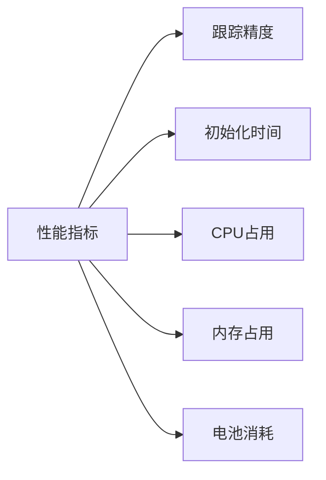

# AR-SDK集成技术调研报告

## 概述
本文档详细介绍了AR-SDK的集成技术方案和实施步骤。

## 主要内容
1. SDK架构设计
2. 集成流程
3. API说明
4. 示例代码
5. 注意事项

## 待补充
具体内容待补充...

## 1. SDK 选型对比

### 1.1 主流 AR SDK

| SDK名称 | 优势 | 劣势 | 适用场景 |
|---------|------|------|----------|
| ARKit   | 精度高、性能好 | 仅iOS平台 | iOS应用 |
| ARCore  | 跨平台、功能丰富 | 设备要求高 | Android应用 |
| Vuforia | 成熟稳定、文档全 | 收费较高 | 商业应用 |
| EasyAR  | 性价比高、中文支持 | 功能相对少 | 轻量级应用 |

### 1.2 性能对比



## 2. 集成方案

### 2.1 iOS 集成

```swift
// 初始化配置
struct ARConfig {
    let license: String
    let features: [ARFeature]
    let tracking: TrackingMode
}

class ARManager {
    private var session: ARSession?
    
    func initialize(config: ARConfig) throws {
        // 检查设备兼容性
        guard ARWorldTrackingConfiguration.isSupported else {
            throw ARError.deviceNotSupported
        }
        
        // 配置AR会话
        let configuration = ARWorldTrackingConfiguration()
        configuration.planeDetection = [.horizontal, .vertical]
        configuration.environmentTexturing = .automatic
        
        // 启动会话
        session = ARSession()
        session?.delegate = self
        session?.run(configuration)
    }
}

// AR会话代理
extension ARManager: ARSessionDelegate {
    func session(_ session: ARSession, didUpdate frame: ARFrame) {
        // 处理每一帧
        processFrame(frame)
    }
    
    func session(_ session: ARSession, didFailWithError error: Error) {
        // 错误处理
        handleError(error)
    }
}
```

### 2.2 Android 集成

```kotlin
// AR管理器
class ARManager(private val context: Context) {
    private var session: Session? = null
    
    fun initialize(config: ARConfig) {
        // 检查ARCore是否安装
        if (!isARCoreInstalled()) {
            installARCore()
            return
        }
        
        // 创建AR会话
        session = Session(context)
        
        // 配置会话
        val config = Config(session)
        config.updateMode = Config.UpdateMode.LATEST_CAMERA_IMAGE
        config.planeFindingMode = Config.PlaneFindingMode.HORIZONTAL_AND_VERTICAL
        
        // 启动会话
        session?.configure(config)
        session?.resume()
    }
    
    // 处理每一帧
    fun onDrawFrame(render: GLSurfaceView) {
        val frame = session?.update()
        frame?.let { processFrame(it) }
    }
}
```

## 3. 核心功能实现

### 3.1 相机控制

```typescript
class CameraController {
    private camera: ARCamera
    
    // 初始化相机
    async initialize(): Promise<void> {
        // 请求相机权限
        const permission = await requestCameraPermission()
        if (!permission) {
            throw new Error('Camera permission denied')
        }
        
        // 配置相机参数
        this.camera = new ARCamera({
            resolution: '1080p',
            frameRate: 30,
            focusMode: 'continuous'
        })
        
        // 启动相机
        await this.camera.start()
    }
    
    // 相机预览
    startPreview(surface: Surface): void {
        this.camera.setPreviewSurface(surface)
    }
}
```

### 3.2 SLAM跟踪

```typescript
interface TrackingResult {
    pose: Matrix4x4
    confidence: number
    features: Feature[]
}

class SLAMTracker {
    // 初始化跟踪器
    initialize(): void {
        this.detector = new FeatureDetector()
        this.matcher = new FeatureMatcher()
        this.optimizer = new PoseOptimizer()
    }
    
    // 跟踪更新
    track(frame: Frame): TrackingResult {
        // 特征检测
        const features = this.detector.detect(frame)
        
        // 特征匹配
        const matches = this.matcher.match(features)
        
        // 位姿估计
        const pose = this.optimizer.optimize(matches)
        
        return {
            pose,
            confidence: this.calculateConfidence(matches),
            features
        }
    }
}
```

## 4. 数据处理流程

### 4.1 图像处理管线

```typescript
class ImagePipeline {
    private processors: ImageProcessor[]
    
    // 添加处理器
    addProcessor(processor: ImageProcessor): void {
        this.processors.push(processor)
    }
    
    // 处理图像
    async process(image: Image): Promise<ProcessedImage> {
        let result = image
        
        // 串行处理
        for (const processor of this.processors) {
            result = await processor.process(result)
        }
        
        return result
    }
}

// 使用示例
const pipeline = new ImagePipeline()
pipeline.addProcessor(new NoiseReducer())
pipeline.addProcessor(new ColorCorrector())
pipeline.addProcessor(new EdgeDetector())
```

### 4.2 3D模型处理

```typescript
class ModelProcessor {
    // 模型优化
    optimizeModel(model: Model3D): Model3D {
        // 简化网格
        const simplifiedMesh = this.simplifyMesh(model.mesh)
        
        // 优化UV
        const optimizedUV = this.optimizeUV(simplifiedMesh)
        
        // 压缩纹理
        const compressedTextures = this.compressTextures(model.textures)
        
        return {
            mesh: simplifiedMesh,
            uv: optimizedUV,
            textures: compressedTextures
        }
    }
    
    // 导出模型
    exportModel(model: Model3D, format: ModelFormat): ArrayBuffer {
        switch (format) {
            case 'gltf':
                return this.exportGLTF(model)
            case 'obj':
                return this.exportOBJ(model)
            case 'fbx':
                return this.exportFBX(model)
            default:
                throw new Error(`Unsupported format: ${format}`)
        }
    }
}
```

## 5. 性能优化

### 5.1 内存优化

```typescript
class MemoryOptimizer {
    private memoryPool: Map<string, ArrayBuffer>
    private maxMemory: number
    
    // 内存复用
    allocate(size: number): ArrayBuffer {
        // 查找可复用的内存
        const buffer = this.findReusableBuffer(size)
        if (buffer) {
            return buffer
        }
        
        // 清理超出限制的内存
        this.cleanupIfNeeded(size)
        
        // 分配新内存
        return new ArrayBuffer(size)
    }
    
    // 内存回收
    recycle(buffer: ArrayBuffer): void {
        const key = this.generateKey(buffer)
        this.memoryPool.set(key, buffer)
    }
}
```

### 5.2 渲染优化

```typescript
class RenderOptimizer {
    // 视锥体剔除
    frustumCulling(scene: Scene, camera: Camera): void {
        const frustum = camera.getFrustum()
        
        scene.objects.forEach(obj => {
            obj.visible = frustum.intersectsBox(obj.boundingBox)
        })
    }
    
    // LOD管理
    updateLOD(objects: Object3D[], camera: Camera): void {
        objects.forEach(obj => {
            const distance = camera.position.distanceTo(obj.position)
            const lod = this.selectLOD(distance)
            obj.setLODLevel(lod)
        })
    }
}
```

## 6. 调试与测试

### 6.1 调试工具

```typescript
class ARDebugger {
    // 可视化调试
    visualize(data: DebugData): void {
        // 显示特征点
        this.visualizeFeatures(data.features)
        
        // 显示平面
        this.visualizePlanes(data.planes)
        
        // 显示跟踪状态
        this.visualizeTracking(data.tracking)
    }
    
    // 性能分析
    profile(): PerformanceData {
        return {
            fps: this.calculateFPS(),
            cpuUsage: this.getCPUUsage(),
            memoryUsage: this.getMemoryUsage(),
            batteryDrain: this.getBatteryDrain()
        }
    }
}
```

### 6.2 自动化测试

```typescript
class ARTester {
    // 功能测试
    async testFeatures(): Promise<TestResult> {
        const results = []
        
        // 测试初始化
        results.push(await this.testInitialization())
        
        // 测试跟踪
        results.push(await this.testTracking())
        
        // 测试重建
        results.push(await this.testReconstruction())
        
        return this.generateReport(results)
    }
    
    // 性能测试
    async testPerformance(): Promise<PerformanceReport> {
        // 测试CPU使用率
        const cpuTest = await this.testCPUUsage()
        
        // 测试内存使用
        const memoryTest = await this.testMemoryUsage()
        
        // 测试帧率
        const fpsTest = await this.testFPS()
        
        return {
            cpu: cpuTest,
            memory: memoryTest,
            fps: fpsTest
        }
    }
}
```

## 7. 发布与更新

### 7.1 版本管理

```typescript
interface Version {
    major: number
    minor: number
    patch: number
    build: string
}

class VersionManager {
    // 检查更新
    async checkUpdate(): Promise<UpdateInfo> {
        const currentVersion = this.getCurrentVersion()
        const latestVersion = await this.fetchLatestVersion()
        
        return {
            hasUpdate: this.compareVersions(currentVersion, latestVersion),
            latestVersion,
            updateUrl: this.getUpdateUrl(latestVersion)
        }
    }
    
    // 执行更新
    async update(): Promise<void> {
        // 下载更新
        const package = await this.downloadUpdate()
        
        // 验证包完整性
        this.verifyPackage(package)
        
        // 安装更新
        await this.installUpdate(package)
    }
}
```

### 7.2 错误上报

```typescript
class ErrorReporter {
    // 错误上报
    reportError(error: Error): void {
        const report = {
            type: error.name,
            message: error.message,
            stack: error.stack,
            device: this.getDeviceInfo(),
            timestamp: Date.now()
        }
        
        // 发送到服务器
        this.sendToServer(report)
        
        // 本地存储
        this.saveLocally(report)
    }
    
    // 性能上报
    reportPerformance(metrics: PerformanceMetrics): void {
        this.sendMetrics(metrics)
    }
}
```

## 8. 安全与隐私

### 8.1 数据安全

```typescript
class SecurityManager {
    // 数据加密
    encrypt(data: ArrayBuffer): ArrayBuffer {
        const key = this.getEncryptionKey()
        return this.aesEncrypt(data, key)
    }
    
    // 安全存储
    secureStore(key: string, data: any): void {
        const encrypted = this.encrypt(data)
        this.keychain.save(key, encrypted)
    }
}
```

### 8.2 隐私保护

```typescript
class PrivacyGuard {
    // 隐私检查
    checkPrivacy(data: ScanData): void {
        // 检查是否包含敏感信息
        this.checkSensitiveInfo(data)
        
        // 检查是否包含个人信息
        this.checkPersonalInfo(data)
        
        // 数据脱敏
        this.anonymize(data)
    }
    
    // 权限管理
    requestPermission(permission: Permission): Promise<boolean> {
        return this.permissionManager.request(permission)
    }
}
``` 