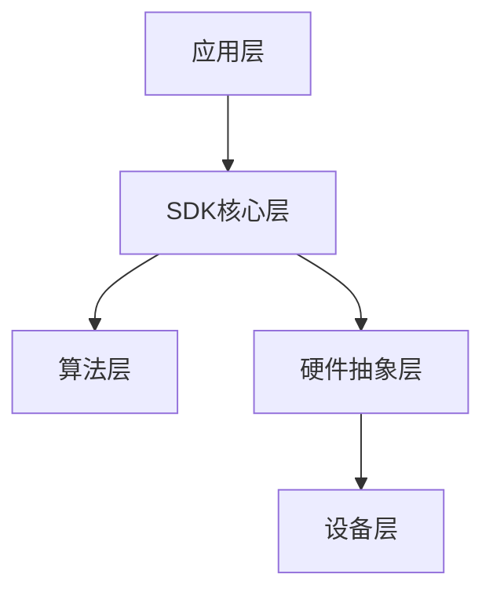

# AR 定损 SDK 工作流程

## 1. SDK 架构

### 1.1 整体架构



### 1.2 模块组成

- 相机控制模块
- AR引擎模块
- AI算法模块
- 数据处理模块
- 网络通信模块

## 2. 初始化流程

### 2.1 SDK 初始化

```typescript
interface SDKConfig {
  license: string;
  mode: 'online' | 'offline';
  resolution: {
    width: number;
    height: number;
  };
  features: string[];
}

class ARSDKManager {
  async initialize(config: SDKConfig): Promise<void> {
    // 验证license
    await this.validateLicense(config.license);
    
    // 初始化相机
    await this.initCamera(config.resolution);
    
    // 初始化AR引擎
    await this.initAREngine();
    
    // 加载AI模型
    await this.loadAIModels();
    
    // 配置工作模式
    this.setWorkMode(config.mode);
  }
}
```

### 2.2 相机配置

```typescript
interface CameraConfig {
  resolution: Resolution;
  frameRate: number;
  focusMode: 'auto' | 'manual';
  exposureMode: 'auto' | 'manual';
}

class CameraManager {
  configure(config: CameraConfig): void {
    // 设置分辨率
    this.setResolution(config.resolution);
    
    // 设置帧率
    this.setFrameRate(config.frameRate);
    
    // 配置对焦模式
    this.setFocusMode(config.focusMode);
    
    // 配置曝光模式
    this.setExposureMode(config.exposureMode);
  }
}
```

## 3. 扫描流程

### 3.1 场景初始化

```typescript
class ScanManager {
  async initializeScene(): Promise<void> {
    // 检测环境光照
    const lightCondition = await this.checkLighting();
    
    // 检测背景
    const backgroundQuality = await this.checkBackground();
    
    // 空间定位
    await this.initializeSLAM();
    
    // 初始化AR锚点
    await this.setupARAnchors();
  }
}
```

### 3.2 扫描控制

```typescript
interface ScanOptions {
  mode: 'quick' | 'detailed';
  quality: 'high' | 'medium' | 'low';
  coverage: number; // 覆盖率要求
}

class ScanController {
  startScan(options: ScanOptions): void {
    // 设置扫描模式
    this.setScanMode(options.mode);
    
    // 设置质量要求
    this.setQualityLevel(options.quality);
    
    // 开始扫描
    this.scan();
    
    // 监控扫描进度
    this.monitorProgress(options.coverage);
  }
}
```

## 4. 数据处理

### 4.1 图像处理

```typescript
interface ImageProcessor {
  // 图像增强
  enhance(image: ImageData): ImageData;
  
  // 图像分割
  segment(image: ImageData): SegmentationResult;
  
  // 特征提取
  extractFeatures(image: ImageData): Features[];
}

class ImageProcessingPipeline {
  async process(frame: VideoFrame): Promise<ProcessedData> {
    // 图像预处理
    const enhanced = await this.enhance(frame);
    
    // 目标检测
    const detections = await this.detect(enhanced);
    
    // 损伤分析
    const damages = await this.analyzeDamage(detections);
    
    return {
      frame: enhanced,
      detections,
      damages
    };
  }
}
```

### 4.2 3D重建

```typescript
interface ReconstructionOptions {
  quality: 'high' | 'medium' | 'low';
  textured: boolean;
  format: '3d' | 'point-cloud';
}

class Reconstructor {
  async reconstruct(frames: VideoFrame[], options: ReconstructionOptions): Promise<Model3D> {
    // 特征匹配
    const matches = await this.matchFeatures(frames);
    
    // 姿态估计
    const poses = await this.estimatePoses(matches);
    
    // 稠密重建
    const pointCloud = await this.denseReconstruction(frames, poses);
    
    // 网格重建
    const mesh = await this.generateMesh(pointCloud);
    
    // 纹理映射
    if (options.textured) {
      await this.applyTextures(mesh, frames);
    }
    
    return mesh;
  }
}
```

## 5. 损伤识别

### 5.1 AI模型调用

```typescript
interface DetectionResult {
  type: string;
  confidence: number;
  bbox: BoundingBox;
  mask?: Mask;
}

class DamageDetector {
  async detect(image: ImageData): Promise<DetectionResult[]> {
    // 运行检测模型
    const detections = await this.model.detect(image);
    
    // 后处理
    const processed = this.postProcess(detections);
    
    // 过滤低置信度结果
    return this.filterResults(processed);
  }
}
```

### 5.2 损伤分析

```typescript
interface DamageAnalysis {
  type: string;
  severity: 'light' | 'medium' | 'severe';
  area: number;
  depth: number;
  repairSuggestion: string;
}

class DamageAnalyzer {
  analyze(detection: DetectionResult, depth: DepthMap): DamageAnalysis {
    // 分析损伤类型
    const type = this.classifyDamage(detection);
    
    // 评估严重程度
    const severity = this.assessSeverity(detection, depth);
    
    // 计算损伤面积
    const area = this.calculateArea(detection.mask);
    
    // 生成修复建议
    const suggestion = this.generateSuggestion(type, severity);
    
    return {
      type,
      severity,
      area,
      depth: this.estimateDepth(depth, detection.bbox),
      repairSuggestion: suggestion
    };
  }
}
```

## 6. 结果输出

### 6.1 数据格式

```typescript
interface ScanResult {
  // 基本信息
  metadata: {
    timestamp: number;
    device: string;
    version: string;
  };
  
  // 3D模型
  model: {
    mesh: Mesh;
    texture: Texture;
    pointCloud: PointCloud;
  };
  
  // 损伤信息
  damages: DamageAnalysis[];
  
  // 统计信息
  statistics: {
    totalDamages: number;
    totalArea: number;
    estimatedCost: number;
  };
}
```

### 6.2 报告生成

```typescript
class ReportGenerator {
  async generateReport(result: ScanResult): Promise<Report> {
    // 生成3D预览
    const preview = await this.generate3DPreview(result.model);
    
    // 生成损伤描述
    const description = this.describeDamages(result.damages);
    
    // 计算维修成本
    const cost = this.calculateRepairCost(result.damages);
    
    // 生成PDF报告
    return this.generatePDF({
      preview,
      description,
      cost,
      metadata: result.metadata
    });
  }
}
```

## 7. 错误处理

### 7.1 错误类型

```typescript
enum ErrorType {
  INITIALIZATION_ERROR = 'INITIALIZATION_ERROR',
  CAMERA_ERROR = 'CAMERA_ERROR',
  TRACKING_ERROR = 'TRACKING_ERROR',
  DETECTION_ERROR = 'DETECTION_ERROR',
  NETWORK_ERROR = 'NETWORK_ERROR'
}

interface SDKError {
  type: ErrorType;
  code: number;
  message: string;
  details?: any;
}
```

### 7.2 错误处理

```typescript
class ErrorHandler {
  handleError(error: SDKError): void {
    // 记录错误
    this.logError(error);
    
    // 错误恢复
    this.recover(error);
    
    // 通知应用层
    this.notifyError(error);
  }
  
  private async recover(error: SDKError): Promise<void> {
    switch (error.type) {
      case ErrorType.TRACKING_ERROR:
        await this.recoverTracking();
        break;
      case ErrorType.CAMERA_ERROR:
        await this.restartCamera();
        break;
      // 处理其他错误类型
    }
  }
}
```

## 8. 性能优化

### 8.1 内存管理

```typescript
class MemoryManager {
  // 资源池
  private resourcePool: Map<string, Resource>;
  
  // 释放资源
  releaseUnused(): void {
    const now = Date.now();
    for (const [key, resource] of this.resourcePool) {
      if (now - resource.lastUsed > this.threshold) {
        resource.dispose();
        this.resourcePool.delete(key);
      }
    }
  }
}
```

### 8.2 渲染优化

```typescript
class RenderOptimizer {
  optimize(scene: Scene): void {
    // 视锥体剔除
    this.frustumCulling(scene);
    
    // LOD管理
    this.updateLOD(scene);
    
    // 合并绘制调用
    this.batchDrawCalls(scene);
  }
}
```

## 9. 调试工具

### 9.1 日志系统

```typescript
class Logger {
  log(level: LogLevel, message: string, data?: any): void {
    const entry = {
      timestamp: Date.now(),
      level,
      message,
      data
    };
    
    // 本地存储
    this.store(entry);
    
    // 远程上报
    if (this.shouldReport(level)) {
      this.report(entry);
    }
  }
}
```

### 9.2 性能监控

```typescript
class PerformanceMonitor {
  monitor(): void {
    // CPU使用率
    this.monitorCPU();
    
    // 内存使用
    this.monitorMemory();
    
    // 帧率
    this.monitorFPS();
    
    // 电池消耗
    this.monitorBattery();
  }
}
``` 