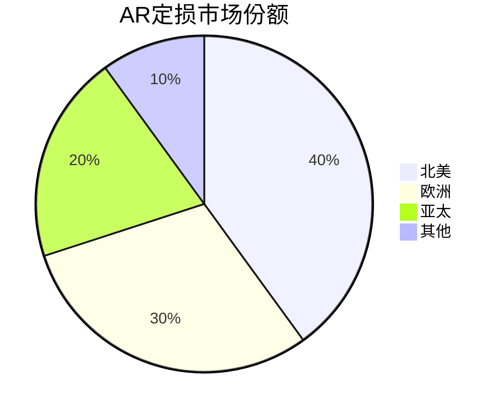
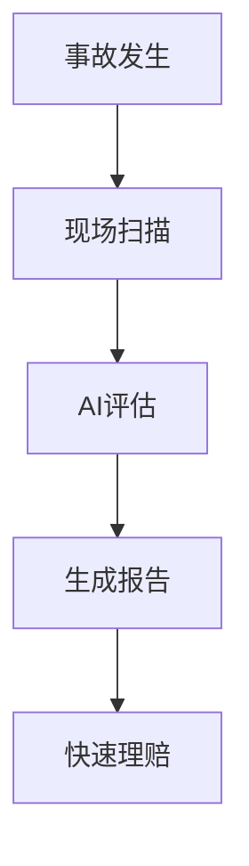
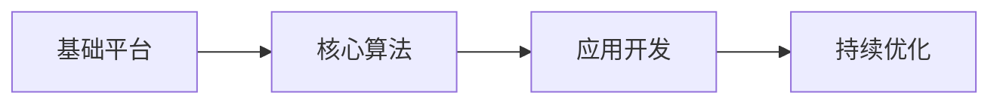

# 海外 AR 定损产品形态

## 1. 市场概况

### 1.1 主要市场

- 北美市场
- 欧洲市场
- 亚太市场
- 中东市场

### 1.2 市场规模



## 2. 产品类型

### 2.1 移动端应用

#### 特点：
- 便携性强
- 操作简单
- 实时处理
- 离线工作

#### 功能：
- 车辆扫描
- 损伤识别
- 报价估算
- 理赔建议

### 2.2 专业设备

#### 特点：
- 精度高
- 功能全面
- 专业性强
- 价格较高

#### 功能：
- 3D建模
- 精确测量
- 历史对比
- 专业报告

## 3. 技术特点

### 3.1 AR核心技术

```typescript
interface ARFeatures {
  // 空间定位
  spatialTracking: {
    accuracy: number;
    updateRate: number;
    method: 'SLAM' | 'Visual-Inertial';
  };
  
  // 3D重建
  reconstruction: {
    quality: 'high' | 'medium' | 'low';
    method: 'photogrammetry' | 'structured-light';
  };
  
  // 损伤识别
  damageDetection: {
    types: string[];
    confidence: number;
    realtime: boolean;
  };
}
```

### 3.2 AI算法

```python
class DamageAssessment:
    def __init__(self):
        self.detector = load_damage_detector()
        self.classifier = load_damage_classifier()
        
    def assess(self, scan_data):
        # 检测损伤
        damages = self.detector.detect(scan_data)
        
        # 分类损伤
        results = []
        for damage in damages:
            damage_type = self.classifier.classify(damage)
            severity = self.estimate_severity(damage)
            repair_cost = self.calculate_cost(damage_type, severity)
            
            results.append({
                'type': damage_type,
                'severity': severity,
                'cost': repair_cost
            })
            
        return results
```

## 4. 产品优势

### 4.1 技术优势

- 高精度3D重建
- 实时损伤识别
- AI智能评估
- 云端协同处理

### 4.2 业务优势

- 提高效率
- 降低成本
- 标准化评估
- 减少争议

## 5. 应用场景

### 5.1 保险理赔



### 5.2 二手车评估

- 车况检查
- 价值评估
- 维修建议
- 交易参考

## 6. 商业模式

### 6.1 销售模式

- 直接销售
- 代理分销
- SaaS服务
- 定制开发

### 6.2 收费模式

- 软件授权
- 使用次数
- 年度订阅
- 增值服务

## 7. 竞品分析

### 7.1 主要竞品

| 公司 | 产品特点 | 市场份额 | 技术优势 |
|------|----------|----------|----------|
| A公司 | 精度高   | 35%      | 3D重建   |
| B公司 | 操作简单 | 25%      | AI算法   |
| C公司 | 响应快   | 20%      | 云计算   |
| D公司 | 成本低   | 15%      | 移动端   |

### 7.2 差异化优势

- 技术创新
- 精度提升
- 效率优化
- 成本控制

## 8. 发展趋势

### 8.1 技术趋势

- 5G+AR融合
- AI算法进化
- 边缘计算
- 量子计算

### 8.2 市场趋势

- 标准化
- 智能化
- 自动化
- 生态化

## 9. 实施建议

### 9.1 技术路线



### 9.2 市场策略

- 市场细分
- 重点突破
- 持续创新
- 生态构建

## 10. 风险控制

### 10.1 技术风险

- 算法准确性
- 系统稳定性
- 数据安全性
- 隐私保护

### 10.2 市场风险

- 竞争加剧
- 政策变化
- 标准更新
- 客户需求 