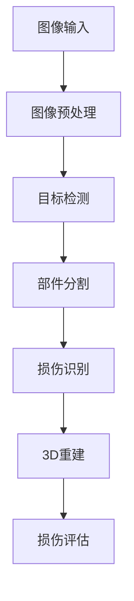

# 车辆损伤检测 AI 算法

## 1. 算法概述

### 1.1 技术原理

车辆损伤检测 AI 算法基于深度学习技术，主要包含以下核心模块：

- 目标检测：定位车辆位置
- 语义分割：识别车辆部件
- 损伤检测：识别损伤类型和程度
- 3D重建：构建车辆3D模型

### 1.2 算法流程



## 2. 图像预处理

### 2.1 图像增强

```python
def enhance_image(image):
    # 亮度调整
    enhanced = cv2.convertScaleAbs(image, alpha=1.2, beta=10)
    
    # 对比度增强
    lab = cv2.cvtColor(enhanced, cv2.COLOR_BGR2LAB)
    l, a, b = cv2.split(lab)
    clahe = cv2.createCLAHE(clipLimit=3.0, tileGridSize=(8,8))
    cl = clahe.apply(l)
    enhanced = cv2.merge((cl,a,b))
    
    return cv2.cvtColor(enhanced, cv2.COLOR_LAB2BGR)
```

### 2.2 图像标准化

```python
def normalize_image(image):
    # 调整图像大小
    resized = cv2.resize(image, (640, 480))
    
    # 归一化
    normalized = resized / 255.0
    
    # 标准化
    mean = np.mean(normalized)
    std = np.std(normalized)
    standardized = (normalized - mean) / std
    
    return standardized
```

## 3. 目标检测

### 3.1 车辆检测模型

使用 YOLOv5 进行车辆检测：

```python
class VehicleDetector:
    def __init__(self):
        self.model = torch.hub.load('ultralytics/yolov5', 'yolov5s')
        self.model.classes = [2, 5, 7]  # 只检测车辆类别
        
    def detect(self, image):
        results = self.model(image)
        vehicles = results.pandas().xyxy[0]
        return vehicles[vehicles['confidence'] > 0.5]
```

### 3.2 关键点检测

```python
def detect_keypoints(image, vehicle_box):
    # 提取车辆区域
    x1, y1, x2, y2 = vehicle_box
    vehicle_roi = image[y1:y2, x1:x2]
    
    # 关键点检测
    keypoints = pose_model.predict(vehicle_roi)
    
    return keypoints
```

## 4. 部件分割

### 4.1 语义分割模型

使用 DeepLab V3+ 进行车辆部件分割：

```python
class PartSegmentation:
    def __init__(self):
        self.model = DeepLabV3Plus(
            encoder_name="resnet101",
            classes=len(VEHICLE_PARTS)
        )
        
    def segment(self, image):
        mask = self.model.predict(image)
        return self.post_process(mask)
        
    def post_process(self, mask):
        # 后处理优化分割结果
        return cv2.medianBlur(mask, 5)
```

### 4.2 部件识别

```python
def identify_parts(segmentation_mask):
    parts = {}
    for part_id in np.unique(segmentation_mask):
        if part_id == 0:  # 背景
            continue
        
        # 获取部件区域
        part_mask = segmentation_mask == part_id
        contours, _ = cv2.findContours(
            part_mask.astype(np.uint8),
            cv2.RETR_EXTERNAL,
            cv2.CHAIN_APPROX_SIMPLE
        )
        
        # 计算部件面积和位置
        parts[VEHICLE_PARTS[part_id]] = {
            'area': cv2.contourArea(contours[0]),
            'bbox': cv2.boundingRect(contours[0])
        }
    
    return parts
```

## 5. 损伤检测

### 5.1 损伤分类器

```python
class DamageClassifier:
    def __init__(self):
        self.model = self.build_model()
        
    def build_model(self):
        base_model = tf.keras.applications.EfficientNetB4(
            include_top=False,
            weights='imagenet',
            input_shape=(224, 224, 3)
        )
        
        model = tf.keras.Sequential([
            base_model,
            tf.keras.layers.GlobalAveragePooling2D(),
            tf.keras.layers.Dense(len(DAMAGE_TYPES), activation='softmax')
        ])
        
        return model
        
    def classify(self, image):
        pred = self.model.predict(image)
        return DAMAGE_TYPES[np.argmax(pred)]
```

### 5.2 损伤定位

```python
def locate_damage(image, part_mask):
    # 提取部件区域
    part_roi = cv2.bitwise_and(image, image, mask=part_mask)
    
    # 边缘检测
    edges = cv2.Canny(part_roi, 100, 200)
    
    # 轮廓检测
    contours, _ = cv2.findContours(
        edges,
        cv2.RETR_EXTERNAL,
        cv2.CHAIN_APPROX_SIMPLE
    )
    
    damages = []
    for contour in contours:
        area = cv2.contourArea(contour)
        if area > 100:  # 过滤小区域
            damages.append({
                'contour': contour,
                'area': area,
                'bbox': cv2.boundingRect(contour)
            })
    
    return damages
```

## 6. 3D重建

### 6.1 深度估计

```python
class DepthEstimator:
    def __init__(self):
        self.model = MonoDepthNet()
        
    def estimate_depth(self, image):
        # 深度图预测
        depth_map = self.model.predict(image)
        
        # 深度图优化
        refined_depth = self.refine_depth(depth_map)
        
        return refined_depth
        
    def refine_depth(self, depth_map):
        # 双边滤波去噪
        filtered = cv2.bilateralFilter(depth_map, 9, 75, 75)
        
        # 深度补全
        completed = self.depth_completion(filtered)
        
        return completed
```

### 6.2 点云生成

```python
def generate_pointcloud(image, depth_map, camera_matrix):
    height, width = depth_map.shape
    points = []
    colors = []
    
    for v in range(height):
        for u in range(width):
            z = depth_map[v, u]
            if z > 0:
                x = (u - camera_matrix[0,2]) * z / camera_matrix[0,0]
                y = (v - camera_matrix[1,2]) * z / camera_matrix[1,1]
                points.append([x, y, z])
                colors.append(image[v, u])
    
    return np.array(points), np.array(colors)
```

## 7. 损伤评估

### 7.1 损伤程度评估

```python
def assess_damage(damage_info):
    score = 0
    
    # 评估面积
    area_score = calculate_area_score(damage_info['area'])
    score += area_score * 0.4
    
    # 评估位置
    location_score = calculate_location_score(damage_info['location'])
    score += location_score * 0.3
    
    # 评估类型
    type_score = calculate_type_score(damage_info['type'])
    score += type_score * 0.3
    
    return score
```

### 7.2 修复建议

```python
def generate_repair_suggestion(damage_assessment):
    suggestions = []
    
    for damage in damage_assessment:
        if damage['score'] > 0.7:
            suggestions.append({
                'part': damage['part'],
                'action': 'replace',
                'urgency': 'high'
            })
        elif damage['score'] > 0.4:
            suggestions.append({
                'part': damage['part'],
                'action': 'repair',
                'urgency': 'medium'
            })
        else:
            suggestions.append({
                'part': damage['part'],
                'action': 'paint',
                'urgency': 'low'
            })
    
    return suggestions
```

## 8. 性能优化

### 8.1 模型优化

- 模型量化
- 模型剪枝
- 知识蒸馏
- TensorRT加速

### 8.2 推理优化

- 批处理
- GPU加速
- 多线程处理
- 内存优化

## 9. 部署方案

### 9.1 移动端部署

- TFLite转换
- NCNN部署
- Metal/OpenCL加速
- 内存优化

### 9.2 服务器部署

- Docker容器化
- GPU服务器
- 负载均衡
- 监控告警 