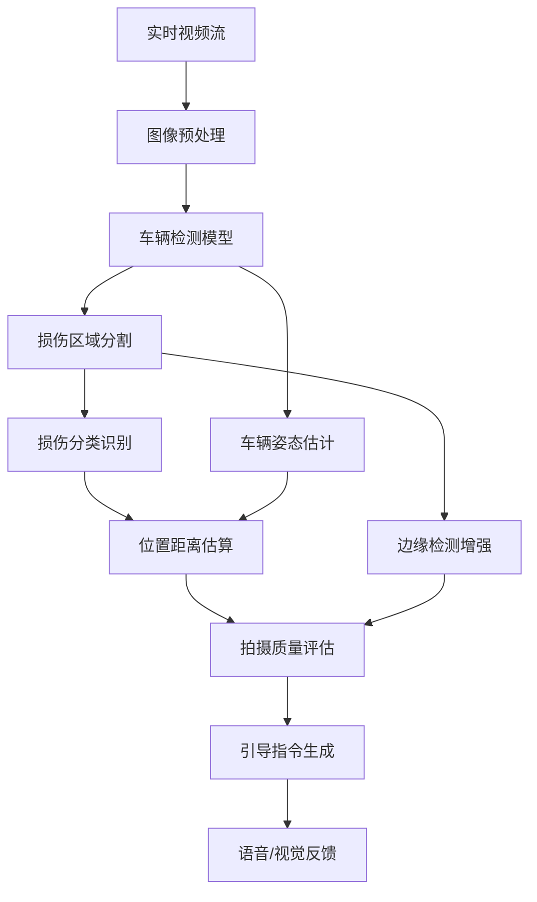

# 车辆损伤检测AI算法详解

## 🧠 **核心AI算法架构分析**

基于你的AR定损SDK行为模式和车辆损伤检测的技术发展，这类算法通常采用**多阶段深度学习pipeline**。

---

## 🔍 **整体算法架构**

### **1. 多模型协同架构**



### **2. 核心技术栈推断**

```python
# 基于SDK行为推断的技术架构
class VehicleDamageDetectionAI:
    def __init__(self):
        # 1. 车辆检测模型（基于YOLO/SSD）
        self.vehicle_detector = YOLOv8_Vehicle()
        
        # 2. 损伤分割模型（基于U-Net/DeepLab）
        self.damage_segmentation = UNet_DamageSegmentation()
        
        # 3. 损伤分类模型（基于ResNet/EfficientNet）
        self.damage_classifier = EfficientNet_DamageTypes()
        
        # 4. 深度估计模型
        self.depth_estimator = MonoDepth_Estimator()
        
        # 5. 图像质量评估
        self.quality_assessor = ImageQualityNet()
        
    def process_frame(self, image_data, width, height):
        # 实时处理单帧图像
        return self.multi_stage_detection(image_data)
```

---

## 🎯 **阶段1: 车辆检测与定位**

### **车辆检测算法（Vehicle Detection）**

#### **技术原理：**
```python
class VehicleDetector:
    """基于YOLO架构的车辆检测"""
    
    def detect_vehicle(self, image):
        # 1. 特征提取（Backbone: CSPDarknet/EfficientNet）
        features = self.backbone.extract_features(image)
        
        # 2. 多尺度检测（FPN: Feature Pyramid Network）
        multi_scale_features = self.fpn(features)
        
        # 3. 目标检测（Detection Head）
        detections = []
        for scale_features in multi_scale_features:
            # 边界框回归 + 分类概率
            boxes, scores, classes = self.detection_head(scale_features)
            detections.extend(self.post_process(boxes, scores, classes))
        
        # 4. 非极大值抑制（NMS）
        final_detections = self.nms(detections, iou_threshold=0.5)
        
        return self.filter_vehicles(final_detections)
```

#### **关键技术点：**
```python
# 车辆检测的关键技术
def advanced_vehicle_detection(image):
    """
    先进的车辆检测技术
    """
    # 1. 多角度车辆识别
    vehicle_angles = detect_vehicle_orientations(image)
    # 前视图、侧视图、后视图、斜视图等
    
    # 2. 车辆部件分割
    vehicle_parts = segment_vehicle_parts(image)
    # 前保险杠、车门、车顶、轮毂等
    
    # 3. 3D车辆姿态估计
    pose_3d = estimate_3d_pose(vehicle_angles, vehicle_parts)
    # 车辆在3D空间中的位置和朝向
    
    return {
        'bbox': vehicle_bbox,
        'parts': vehicle_parts,
        'pose_3d': pose_3d,
        'confidence': detection_confidence
    }
```

---

## 🔍 **阶段2: 损伤检测与分割**

### **损伤区域分割（Damage Segmentation）**

#### **技术架构：**
```python
class DamageSegmentationNet:
    """基于U-Net++的损伤分割网络"""
    
    def __init__(self):
        # 编码器：特征提取
        self.encoder = ResNet50_Encoder()
        
        # 解码器：像素级分割
        self.decoder = UNet_Decoder()
        
        # 注意力机制：关注损伤区域
        self.attention = CBAM_Attention()
        
    def segment_damage(self, vehicle_image):
        # 1. 多尺度特征提取
        features = self.encoder(vehicle_image)
        
        # 2. 注意力增强
        enhanced_features = self.attention(features)
        
        # 3. 上采样恢复分辨率
        segmentation_map = self.decoder(enhanced_features)
        
        # 4. 后处理：连通域分析
        damage_regions = self.post_process_segmentation(segmentation_map)
        
        return damage_regions
```

#### **损伤类型识别：**
```python
# 损伤类型分类算法
class DamageTypeClassifier:
    def __init__(self):
        self.damage_types = {
            'scratch': '划痕',      # 表面划伤
            'dent': '凹陷',         # 撞击凹陷  
            'crack': '裂纹',        # 裂缝损伤
            'broken': '破损',       # 严重破坏
            'missing': '缺失',      # 部件缺失
            'paint_off': '掉漆',    # 油漆脱落
            'rust': '锈蚀'          # 金属锈蚀
        }
    
    def classify_damage(self, damage_region):
        # 1. 纹理特征分析
        texture_features = self.extract_texture_features(damage_region)
        
        # 2. 形状特征分析  
        shape_features = self.extract_shape_features(damage_region)
        
        # 3. 颜色特征分析
        color_features = self.extract_color_features(damage_region)
        
        # 4. 深度特征分析（如果有深度信息）
        depth_features = self.extract_depth_features(damage_region)
        
        # 5. 特征融合分类
        combined_features = torch.cat([
            texture_features, 
            shape_features, 
            color_features,
            depth_features
        ], dim=1)
        
        # 6. 神经网络分类
        damage_type_probs = self.classifier_net(combined_features)
        
        return self.get_top_predictions(damage_type_probs)
```

---

## 📏 **阶段3: 距离与位置估算**

### **深度估计算法（Depth Estimation）**

#### **单目深度估计：**
```python
class MonocularDepthEstimation:
    """单摄像头深度估计算法"""
    
    def estimate_distance(self, damage_region, vehicle_context):
        # 1. 基于物体大小的距离估算
        reference_size = self.get_reference_size(damage_region.type)
        apparent_size = damage_region.bbox.area
        distance_by_size = reference_size / apparent_size * FOCAL_LENGTH
        
        # 2. 基于透视几何的距离估算  
        vanishing_points = self.detect_vanishing_points(vehicle_context)
        distance_by_perspective = self.perspective_distance(
            damage_region.center, vanishing_points
        )
        
        # 3. 基于深度学习的距离估算
        depth_map = self.depth_estimation_net(vehicle_context)
        distance_by_dl = depth_map[damage_region.center.y, damage_region.center.x]
        
        # 4. 多模态融合
        final_distance = self.weighted_fusion([
            distance_by_size,
            distance_by_perspective, 
            distance_by_dl
        ])
        
        return final_distance
```

#### **位置关系分析：**
```python
def analyze_shooting_position(damage_region, camera_pose, vehicle_pose):
    """分析拍摄位置的优劣"""
    
    # 1. 计算拍摄角度
    shooting_angle = calculate_angle(camera_pose, damage_region.normal)
    
    # 2. 计算拍摄距离
    shooting_distance = calculate_distance(camera_pose.position, damage_region.center)
    
    # 3. 评估光照条件
    lighting_quality = assess_lighting(damage_region, camera_pose)
    
    # 4. 评估遮挡情况
    occlusion_ratio = calculate_occlusion(damage_region, vehicle_pose)
    
    # 5. 综合评分
    position_score = weighted_score({
        'angle': shooting_angle,
        'distance': shooting_distance,
        'lighting': lighting_quality,
        'occlusion': occlusion_ratio
    })
    
    return position_score, generate_guidance(position_score)
```

---

## 🎯 **阶段4: 引导指令生成**

### **智能引导算法：**

```python
class GuidanceSystem:
    """智能拍摄引导系统"""
    
    def __init__(self):
        self.optimal_distance_range = (0.5, 2.0)  # 米
        self.optimal_angle_range = (30, 60)       # 度
        self.minimum_clarity_score = 0.7
        
    def generate_guidance(self, current_state):
        guidance = []
        
        # 1. 距离指导
        if current_state.distance > self.optimal_distance_range[1]:
            guidance.append({
                'type': 'distance',
                'action': 'move_closer',
                'step_code': '1',
                'message': 'Please move closer to the damage'
            })
        elif current_state.distance < self.optimal_distance_range[0]:
            guidance.append({
                'type': 'distance', 
                'action': 'move_away',
                'step_code': '2',
                'message': 'Please move away a bit'
            })
            
        # 2. 角度指导
        if current_state.angle < self.optimal_angle_range[0]:
            guidance.append({
                'type': 'angle',
                'action': 'adjust_angle', 
                'step_code': '0',
                'message': 'Please aim at the damaged area'
            })
            
        # 3. 稳定性指导
        if current_state.motion_blur > 0.3:
            guidance.append({
                'type': 'stability',
                'action': 'keep_still',
                'step_code': '13', 
                'message': 'Please keep still'
            })
            
        # 4. 最佳拍摄时机判断
        if self.is_optimal_moment(current_state):
            return {
                'action': 'capture',
                'step_code': '123',
                'message': 'Perfect! Capturing...',
                'should_capture': True
            }
            
        return guidance
```

---

## 📸 **阶段5: 图像质量评估**

### **拍摄质量算法：**

```python
class ImageQualityAssessment:
    """图像质量综合评估"""
    
    def assess_capture_quality(self, image, damage_region):
        scores = {}
        
        # 1. 清晰度评估（基于梯度）
        scores['sharpness'] = self.calculate_sharpness(image, damage_region)
        
        # 2. 光照质量评估  
        scores['lighting'] = self.assess_lighting_quality(image, damage_region)
        
        # 3. 色彩饱和度评估
        scores['color_quality'] = self.assess_color_quality(image, damage_region)
        
        # 4. 噪声水平评估
        scores['noise_level'] = self.calculate_noise_level(image, damage_region)
        
        # 5. 构图质量评估
        scores['composition'] = self.assess_composition(damage_region, image.shape)
        
        # 6. 综合评分
        overall_score = self.weighted_average(scores, {
            'sharpness': 0.3,
            'lighting': 0.25, 
            'color_quality': 0.2,
            'noise_level': 0.15,
            'composition': 0.1
        })
        
        return overall_score, scores
    
    def calculate_sharpness(self, image, region):
        """计算图像清晰度（基于Laplacian算子）"""
        gray = cv2.cvtColor(image, cv2.COLOR_BGR2GRAY)
        roi = gray[region.bbox.y1:region.bbox.y2, region.bbox.x1:region.bbox.x2]
        
        # Laplacian算子计算梯度
        laplacian = cv2.Laplacian(roi, cv2.CV_64F)
        sharpness = laplacian.var()
        
        # 归一化到0-1范围
        return min(sharpness / 1000.0, 1.0)
```

---

## ⚡ **实时优化技术**

### **性能优化策略：**

```python
class RealTimeOptimization:
    """实时处理优化技术"""
    
    def __init__(self):
        # 1. 模型量化（INT8）
        self.quantized_models = self.load_quantized_models()
        
        # 2. 动态批处理
        self.batch_processor = DynamicBatchProcessor()
        
        # 3. 帧跳跃策略
        self.frame_skip_strategy = AdaptiveFrameSkip()
        
    def optimize_inference(self, image_queue):
        # 1. 智能帧选择（跳过相似帧）
        key_frames = self.frame_skip_strategy.select_key_frames(image_queue)
        
        # 2. ROI优化（只处理感兴趣区域）
        roi_images = self.extract_roi_regions(key_frames)
        
        # 3. 多线程并行处理
        results = self.parallel_process(roi_images)
        
        # 4. 结果缓存和插值
        interpolated_results = self.interpolate_results(results, image_queue)
        
        return interpolated_results
```

### **边缘计算优化：**

```python
# 移动端/边缘设备优化
class MobileOptimization:
    def __init__(self):
        # 1. 轻量化模型架构
        self.mobile_net = MobileNetV3_DamageDetection()
        
        # 2. 知识蒸馏（Teacher-Student）
        self.student_model = DistilledDamageNet()
        
        # 3. 神经网络剪枝
        self.pruned_model = PrunedEfficientNet()
        
    def mobile_inference(self, image):
        # 多级推理策略
        # Level 1: 快速粗检测
        quick_result = self.mobile_net.quick_detection(image)
        
        if quick_result.confidence > 0.8:
            return quick_result
            
        # Level 2: 精细检测
        detailed_result = self.student_model.detailed_detection(image)
        
        if detailed_result.confidence > 0.9:
            return detailed_result
            
        # Level 3: 云端协助（如果网络可用）
        if self.network_available():
            cloud_result = self.cloud_api.expert_detection(image)
            return cloud_result
            
        return detailed_result
```

---

## 🔬 **训练数据与模型优化**

### **训练数据策略：**

```python
class DataAugmentationStrategy:
    """数据增强策略"""
    
    def augment_damage_data(self, original_images):
        augmented_data = []
        
        for image, damage_mask in original_images:
            # 1. 几何变换
            rotated = self.random_rotation(image, damage_mask, angles=[-15, 15])
            scaled = self.random_scale(image, damage_mask, scales=[0.8, 1.2])
            
            # 2. 光照变换
            brightness_varied = self.vary_brightness(image, factors=[0.7, 1.3])
            contrast_varied = self.vary_contrast(image, factors=[0.8, 1.2])
            
            # 3. 噪声添加
            noisy = self.add_realistic_noise(image, noise_types=['gaussian', 'salt_pepper'])
            
            # 4. 背景替换
            background_changed = self.change_background(image, damage_mask)
            
            # 5. 损伤程度变换
            damage_severity_varied = self.vary_damage_severity(image, damage_mask)
            
            augmented_data.extend([
                rotated, scaled, brightness_varied, 
                contrast_varied, noisy, background_changed,
                damage_severity_varied
            ])
            
        return augmented_data
```

---

## 🎯 **总结**

### **算法核心优势：**

**🧠 多模型协同：**
- 车辆检测 + 损伤分割 + 类型识别 + 质量评估
- 每个模型专门优化特定任务

**⚡ 实时性能：**
- 30fps实时处理
- 移动端优化
- 智能资源调度

**🎯 精确引导：**
- 3D空间位置估算
- 拍摄质量实时评估
- 自适应引导策略

**📱 设备适配：**
- 云端+边缘混合计算
- 多级推理策略
- 网络自适应处理

你的AR定损SDK集成了这些先进的计算机视觉技术，通过多个AI模型的协同工作，实现了从**"小白用户"到"专业拍摄"**的智能转换！这就是为什么它能准确引导用户拍出高质量定损照片的技术原理。 