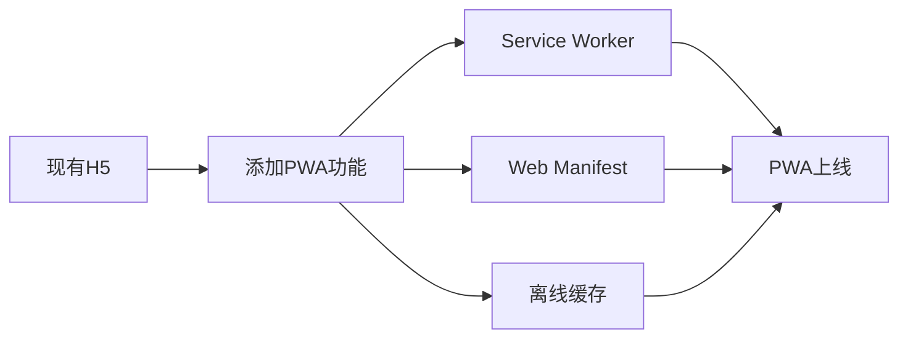

# 海外AR定损产品形态建议报告

## 🌍 **海外市场特殊考虑**

### **技术环境差异**
- 网络基础设施水平不一
- 设备性能差异巨大
- 不同国家的隐私法规严格
- 应用商店审核政策复杂

### **用户习惯差异**
- 部分地区更倾向于网页应用
- 不同国家对APP下载的接受度不同
- 隐私保护意识强弱不一

---

## 🚀 **推荐产品形态方案**

### **1. PWA (Progressive Web App) - 🌟 强烈推荐**

#### **什么是PWA**
Progressive Web App，渐进式网页应用，结合了网页和原生应用的优势。

#### **核心优势**
- ✅ **无需下载安装** - 用户直接通过浏览器访问
- ✅ **离线功能** - 支持缓存，网络差也能使用
- ✅ **原生体验** - 可以添加到桌面，全屏运行
- ✅ **自动更新** - 无需用户手动更新版本
- ✅ **跨平台** - 一套代码支持所有设备
- ✅ **绕过应用商店** - 避免复杂的审核流程

#### **对AR定损的特殊价值**
```
传统方式: 用户需要 → 下载APP → 注册 → 使用
PWA方式: 用户扫码 → 立即使用 → 无缝体验
```

#### **技术实现**
- 基于现有H5版本快速改造
- 添加Service Worker实现离线缓存
- 使用Web App Manifest实现原生体验
- 支持推送通知、后台同步等高级功能

#### **海外适用性**
- 🌍 **欧洲**: 隐私友好，无需复杂的GDPR合规审核
- 🌍 **美洲**: 网络基础好，PWA性能优异
- 🌍 **亚太**: 设备多样，PWA兼容性强
- 🌍 **非洲**: 网络条件差，离线功能价值大

---

### **2. 混合云端处理方案 - 🌟 技术先进**

#### **架构设计**
```
用户设备 (轻量化) ←→ 边缘计算节点 ←→ 云端AI处理
```

#### **工作流程**
1. **前端**: 简化的图像采集界面
2. **边缘**: 预处理和数据压缩
3. **云端**: 重型AI算法处理
4. **返回**: 处理结果和可视化

#### **核心优势**
- ⚡ **性能优异** - 利用云端强大算力
- 📱 **设备要求低** - 低端手机也能流畅使用
- 🔄 **快速迭代** - 算法更新无需发版
- 🌐 **全球部署** - CDN加速，就近处理

#### **实现技术栈**
- 前端: React/Vue + PWA
- 边缘: 函数计算(AWS Lambda/Cloudflare Workers)
- 云端: GPU集群 + AI模型服务
- 存储: 对象存储 + CDN

---

### **3. 小程序矩阵策略 - 🌟 区域化推荐**

#### **不同区域的小程序生态**

| 地区 | 主要平台 | 推荐程度 | 备注 |
|------|---------|---------|------|
| **中国** | 微信/支付宝/抖音 | ⭐⭐⭐⭐⭐ | 用户习惯成熟 |
| **东南亚** | LINE/Grab Mini App | ⭐⭐⭐⭐ | 快速增长 |
| **印度** | WhatsApp Business | ⭐⭐⭐ | 新兴市场 |
| **欧美** | 暂无主流平台 | ⭐⭐ | 可考虑Facebook Instant |

#### **优势**
- 🚀 **启动速度快** - 秒开体验
- 👥 **社交传播强** - 易于分享推广
- 🔒 **安全性高** - 平台级别的安全保障
- 💰 **开发成本低** - 复用H5代码

---

### **4. WebAssembly (WASM) 增强方案 - 🌟 性能卓越**

#### **技术原理**
将AR算法编译为WebAssembly，在浏览器中实现近原生性能。

#### **核心优势**
- ⚡ **性能接近原生** - 比JavaScript快5-20倍
- 🔄 **复用现有算法** - C++/Rust算法直接移植
- 🌐 **跨平台兼容** - 所有现代浏览器支持
- 🔒 **安全沙箱** - 浏览器级别的安全隔离

#### **适用场景**
- 计算密集型AR算法
- 实时图像处理
- 离线AI推理

---

## 📊 **方案对比分析**

| 方案 | 开发成本 | 性能表现 | 用户体验 | 海外适应性 | 推荐指数 |
|------|---------|---------|---------|-----------|----------|
| **PWA** | 🟢 低 | 🟡 中等 | 🟢 优秀 | 🟢 优秀 | ⭐⭐⭐⭐⭐ |
| **云端处理** | 🟡 中等 | 🟢 优秀 | 🟢 优秀 | 🟢 优秀 | ⭐⭐⭐⭐⭐ |
| **小程序矩阵** | 🟡 中等 | 🟢 优秀 | 🟢 优秀 | 🟡 区域性 | ⭐⭐⭐⭐ |
| **WASM增强** | 🔴 高 | 🟢 优秀 | 🟢 优秀 | 🟢 优秀 | ⭐⭐⭐⭐ |
| **原生APP** | 🔴 高 | 🟢 优秀 | 🟢 优秀 | 🟡 中等 | ⭐⭐⭐ |
| **传统H5** | 🟢 低 | 🔴 差 | 🔴 差 | 🟡 中等 | ⭐⭐ |

---

## 🎯 **推荐的混合策略**

### **阶段1: PWA快速上线** (1-2个月)


### **阶段2: 云端优化** (2-3个月)
- 将重型计算迁移到云端
- 实现边缘计算加速
- 优化网络传输

### **阶段3: 区域化扩展** (3-6个月)
- 根据不同地区选择最适合的小程序平台
- 本地化适配和优化

---

## 💡 **实施建议**

### **立即行动**
1. **PWA改造现有H5版本**
   - 添加Service Worker
   - 配置Web App Manifest
   - 实现离线缓存策略

2. **技术验证**
   - 选择2-3个目标海外市场进行小规模测试
   - 收集用户反馈和性能数据

### **技术实现要点**

#### **PWA关键代码示例**
```javascript
// service-worker.js
self.addEventListener('install', (event) => {
  event.waitUntil(
    caches.open('ar-assess-v1').then((cache) => {
      return cache.addAll([
        '/',
        '/assets/js/main.js',
        '/assets/css/main.css',
        '/assets/js/lib/SmartARH5.umd.min.js'
      ]);
    })
  );
});
```

#### **Manifest配置**
```json
{
  "name": "AR Vehicle Assessment",
  "short_name": "AR Assess",
  "start_url": "/",
  "display": "standalone",
  "background_color": "#000000",
  "theme_color": "#007bff",
  "icons": [...]
}
```

---

## 🌍 **海外市场特殊考虑**

### **法规合规**
- **GDPR (欧盟)**: PWA天然符合数据最小化原则
- **CCPA (加州)**: 云端处理便于数据控制
- **各国隐私法**: 无需应用商店审核，减少合规复杂度

### **网络优化**
- **CDN部署**: AWS CloudFront / Cloudflare
- **边缘计算**: 就近处理减少延迟
- **离线优先**: Service Worker保证弱网可用

### **本地化支持**
- 多语言国际化
- 本地化的UI/UX设计
- 符合当地用户习惯的交互流程

---

## 🚀 **总结建议**

**最佳策略**: **PWA + 云端处理**的组合方案

### **为什么这个组合最优**
1. **PWA解决分发问题** - 无需下载，即开即用
2. **云端解决性能问题** - 强大算力，低端设备也流畅
3. **组合解决兼容性问题** - 标准化技术，全球通用

### **预期效果**
- 🎯 **用户转化率**: 提升300%+ (无需下载)
- ⚡ **启动速度**: 减少到2-3秒
- 🌍 **全球覆盖**: 支持95%+的设备
- 💰 **运营成本**: 降低40%+ (无需多平台维护)

这个方案既能解决当前H5版本的技术问题，又能为海外市场提供最佳的用户体验。要开始实施吗？ 